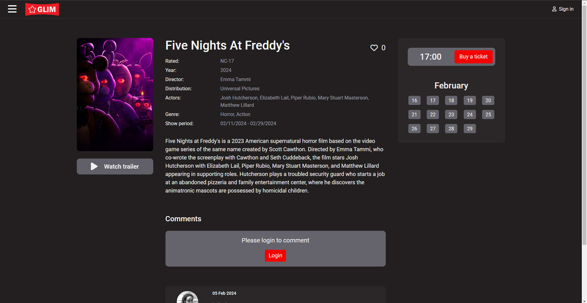
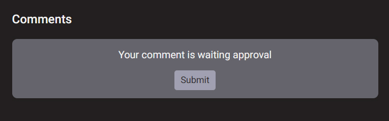

# Glim

    

 

[View GLIM on Heruko](https://glim-9f608ab3b04d.herokuapp.com/)

 

## Project goals

Glim is designed to be a ticket booking web site for a small (family type) cinema theatre, it should:

1. Provide an easy way to check what are the movies currently in theatre, read other users reviews and post your own review check popularity of each movie and book your ticket.
2. Deliver a simple and intuitive user experience, suitable for everyone.
3. Offer a minimal set of impactful features chosen in order to deliver a useful app within an achievable development timeframe, while laying a solid foundation for additional features in the future.

This is the repository for the React frontend of Glim.
The project also utilizes a Django Rest Framework web API, the repository for which is located [here](https://github.com/AhmadAlmasriDev/glim-api).

## Table of contents

-   [Glim](#glim)

    -   [Project goals](#project-goals)
    -   [Table of contents](#table-of-contents)
    -   [Epics and user stories](#epics-and-user-stories)

    -   [Agile development methodology](#agile-development-methodology)
    -   [Planning](#planning)
        -   [Mockups](#mockups)
        -   [Data models](#data-models)
    -   [Design](#design)
        -   [Colours](#colours)
        -   [Logo](#logo)
        -   [Fonts](#fonts)
    -   [Features](#features)
        -   [Landing page with carousel](#landing-page-with-carousel)
        -   [Sign-up form](#Sign-up-form)
        -   [Sign-in form](#sign-in-form)
        -   [Header with welcome message and notifications](#header-with-welcome-message-and-notifications)
        -   [Side Navmenu](#side-Navmenu)
        -   [Interactive movie banner](#interactive-movie-banner)
        -   [Social media links](#social-media-links)
        -   [Buttons Hover effect](#buttons-hover-effect)
        -   [Movie trailer](#movie-trailer)
        -   [The movie page](#the-movie-page)
        -   [Movie comments](#movie-comments)
        -   [About page with Google maps](#about-page-with-Google-maps)
        -   [Movies page](#movies-page)
        -   [Movie add-edit form](#movie-add-edit-form)
        -   [Tickets and seats page](#tickets-and-seats-page)
        -   [Confirmation modals](#confirmation-modals)
        -   [Re-use of components](#re-use-of-components)
            -   [`Asset.jsx`](#assetjsx)
            -   [`CloseButton.jsx`](#closebuttonjsx)
            -   [`TicketForm.jsx`](#ticketformjsx)
            -   [`TrailerButton.jsx`](#trailerbuttonjsx)
            -   [`Like.jsx`](#likejsx)
            -   [`MoviePoster.jsx`](#movieposterjsx)
            -   [`SideNavAvatar.jsx`](#sidenavavatarjsx)
            -   [`Logo.jsx`](#logojsx)
        -   [CRUD functionality](#crud-functionality)
        -   [Future improvements and features](#future-improvements-and-features)
            -   [Short term future improvements](#short-term-future-improvements)
            -   [Longer term future features](#longer-term-future-features)
    -   [Frameworks, libraries and dependencies](#frameworks--libraries-and-dependencies)
        -   [React-Router-DOM](#react-router-dom)
        -   [ReactDOM](#reactdom)
        -   [Axios](#axios)
        -   [JWT Decode](#jwt-decode)
        -   [React Bootstrap](#react-bootstrap)
        -   [React Google maps](#react-google-maps)
        -   [Cloudinary-react](#cloudinary-react)
        -   [React-infinite-scroll-component](#react-infinite-scroll-component)
        -   [React-moment](#react-moment)
        -   [Github](#github)
        -   [Balsamiq](#balsamiq)
        -   [Google Fonts](#google-fonts)
        -   [Font Awesome](#font-awesome)
        -   [Elephantsql](#elephantsql)
        -   [Heroku](#heroku)
    -   [React features used to enhance user experience](#react-features-used-to-enhance-user-experience)
        -   [Custom hooks](#custom-hooks)
    -   [Testing](#testing)
    -   [Deployment](#deployment)
    -   [Credits](#credits)
        -   [Code](#code)
        -   [Media](#media)

## Epics and user stories

There are 7 epics and 31 user stories in this project:

1. Epic: registration / log in

    User Stories:

    - As a manager I can log in to the website so that I can add, edit or delete movies and info, and have admin privileges
    - As a user I can log in to the website so that I can interact with other users
    - As a user I can register on the website so that I can create an account

2. EPIC: profiles

    User Stories:

    - As a registered user I can have my avatar and username on the navbar so that I can know that I am logged in and get access to the user menu
    - As a registered user I can access my profile page so that I can check my info and tickets
    - As a registered user I can update my profile email so that I can receive important messages
    - As a registered user I can update my profile avatar so that I can distinguish my profile

3. EPIC: about info

    User Stories:

    - As a un registered user / manager, registered user / manager I can click on the social media info buttons so that I can check popularity and other info about the cinema
    - As a un registered user / manager, registered user / manager I can send a message to the admin so that I can ask a question or complain
    - As a un registered user / manager, registered user / manager I can view info about the cinema so that I can decide to buy a ticket or not
    - As a un registered user / manager, registered user / manager I can send a message to the admin so that I can ask a question or complain

4. EPIC: movies

    User Stories:

    - As a manager I can delete a movie so that I can manage the website
    - As a manager I can update a movie so that I can manage the website
    - As a manager I can create a draft movie so that I can edit it later
    - As a manager I can add a movie so that I can manage the website
    - As a unregistered user / registered user / manager I can watch a movie trailer so that I can decide to watch it or not
    - As a unregistered user / manager, registered user / manager I can view the comments on a movie so that I can get some info about it
    - As a unregistered user / manager, registered user / manager I can view the details about a movie so that I can decide to watch it or not
    - As a unregistered user / manager, registered user / manager I can view the quantity of comments so that I can check popularity of the movie
    - As a un registered user / manager, registered user / manager I can view the quantity of likes so that I can check popularity of the movie
    - As a unregistered user / manager, registered user / manager I can view the home page so that I can see the movies available to watch and be able to register

5. EPIC: interact

    User Stories:

    - As a manager I can validate users comments so that I can manage the comments section
    - As a registered user / manager I can delete a comment on a movie so that I can interact with other users
    - As a registered user / manager I can write a comment on a movie so that I can interact with other users
    - As a registered user / manager I can like a movie so that I can interact with other users
    - As a registered user / manager I can update a comment on a movie so that I can interact with other users

6. EPIC: tickets

    User Stories:

    - As a registered user / manager I can reserve a seat so that I can buy a ticket
    - As a registered user / manager I can choose a show date so that I can buy the right ticket
    - As a registered user / manager I can view the hall info so that I can reserve a seat
    - As a unregistered user / manager, registered user / manager I can view the reserved seats for a movie so that I can check the availability

7. EPIC: tickets

    User Stories:

    - As a registered user / manager I can cancel the reserve for a seat so that I can buy the ticket quantity needed
    - As a registered user / manager I can pay for the ticket so that I can attend the movie show on that date

## Agile development methodology

GitHub issues and projects were used to document and track an agile development approach.
A GitHub issue was created for each user story, with labels to indicate if they were required for the MVP. A GitHub milestone was created to represent the product backlog. All user stories were initially added to the product backlog.

A GitHub project board was created for each iteration, and user stories moved from the product backlog into the relevant iteration as each cycle of work began. User stories were labelled as 'must have', 'could have' or 'should have' goals for that specific iteration, and assigned story point values.

A project kanban board was used to track progress, with user stories moved between 'Todo', 'In Progress' and 'Done' columns as appropriate.

  
Kanban Board

 

The project boards in their final form can be accessed at [Glim GitHub Project Board](https://github.com/users/AhmadAlmasriDev/projects/4).

## Planning

### Mockups

Wireframes were produced based on those user stories that had been identified as required for the MVP.
These were based on a desktop view of the site, as Glim is mainly desktop first web app.

  
Wireframe

 
The wireframes were critical to the development of the site and were invaluable in terms of mapping and visualising the 'flow' through the site and the UI, however the final product varies from the wireframes in a number of respects, largely for technical and/or usablility reasons:

-   The trailer button on the movie banner in the home page was placed under the like and comment notifications.
-   A calendar was added to each movie banner, the calendar contains the show dates for that movie.
-   The dropdown menu on the navbar was dropped in favor of the side navbar and for simplicity only the name of the user shows on the navbar.
-   The final side bar contains functionality to log in and out and shows the user's avater and a link to the user profile
-   The other movies in the movie page were dropped and replaced with the comments section.
-   The contact us page was dropped in favor of adding contact us form to the about page.
-   A movies page was added with deferent functionality depending on the users role.
-   A trailer page was added.
-   A profile page was added with the functionality to show user tickets and comments
-   A profile edit form was added
-   A movie add and edit forms were added
-   confirmation modals where added for comment deleting, movie deleting, and ticket reserving.

I am sure that there should be a better way of doing this, but this is the only solution I could find with my current knowledge.

### Data models

Data models were planned alongside the wireframes. These are documented in the read-me for the [Glim Django Rest Framework API](https://github.com/AhmadAlmasriDev/glim-api).

## Design

In this project I wanted to test my knowledge, so I choose A difficult to implement design that is used in this cinema theatre [multiplex](https://multiplex.ua/). the UI was implemented using CSS and only the forms used [Bootstrap](https://react-bootstrap.netlify.app/) for input validation.
of course the design was changed a little bit to meet the project requirements.

### Colours

The color scheme was created in [coolors](https://coolors.co/)
and mostly consisted of shades of red and gray.

  
Color Scheme

 

### Logo

The logo design is clear and simple, and consist of two formats:

-   compact (used for favicon)
-   regular (used in the navbar)

  
Logo

 

### Fonts

Google fonts were used for the project.
The font that was used through the whole website is [Roboto](https://fonts.google.com/specimen/Roboto), and it complements the design concept.

  
Roboto Font

 

## Features

### Landing page with carousel

The landing page features a carousel of the currently in theatre movies.
For each movie the show days and months are calculated and is viewed on the calendar on each movie banner.

-   If the starting date is after the current date then the calendar will start from the current date.
-   if the end date is before the current date then the movie will not be in the carousel (not in theatre).
-   if the show dates period happens to be divided between two months, the banner will display these months and the show days

    

### Sign-up form

The sign-up form enables a user to open a new account. As well as entering a user name and password for the account.

    

### Sign-in form

The sign-in form enables a user to login using their user name and password.

    

### Header with welcome message and notifications

The site header contains the logo/name of the site, a welcome message to provide clear feedback to the user, sign-in button and a bar menu.

    

    

### Side Navmenu

When the bar menu button is clicked, a side navmenu appears from the left side, the navmenu contains links to other web pages, social media links, and sign-in button. for registered users there is a user avatar, a link to the user profile and log-out button

    

 

    
    

### Interactive movie banner

Each movie banner in the carousel is made interactive, when the user hovers on the banner the functionality related to that movie appears, and the user can like, dislike, see the number of likes and comments, pick a date from the calendar to book a seat go to the movie page or watch a trailer. and if the show period extends for two months, the calendar will show these two months.

    

  
Two Months Period

 

### Social media links

Social media links in the most popular platforms are accessed through the side navmenu.

    

### Buttons Hover effect

All the buttons have hover effect in order to enhance the user experience.

    

    

### Movie trailer

The user can watch a movie trailer for each movie, the watch trailer button is on the movie banner and in the movie page.

    

### The movie page

In the movie page the user have access to multiple functionalities regarding this movie and depending on if the user is registered or not.
Unregistered users can read info regarding this movie, watch a trailer or read comments.
Registered users can comment, like, and book a seat.

    

### Movie comments

Registered users can leave a comment. The comment must be validated by the administrator before appearing. The user can delete his own comment.
The comments have lazy loading functionality.

The comment form

    

The comment awaits approval

    

Unregistered user

    

Other user's comment

    

User's own comment

    

### About page with Google maps

Information about the cinema theatre, and the location is shown with the help of google maps API.

    

### Movies page

The movies page contains all the movies, the currently in theatres movies and old entries. the functionality depends on the user role. for users you can see all the movies and check the movie's page. managers can add, edit, or delete a movie.
For each movie, if the end date is after the current date, the movie will appear in the in theatres now section otherwise it will be displayed in the old entries section.

    

 

    

### Movie add-edit form

The form appears if the user clicked the edit or add button in the movies page, the buttons only appear if the user is a manager. And if accessed from the address bar it will redirect the user to the home page.

    

### Profile page

The profile page can be accessed from the side navmenu, and it contains information about the user name, email, and about.
Only the profile user have access to this page.
The user can also check his tickets and comments.
the comments and the tickets has lazy loading functionality.

    

### Profile edit form

The user can edit His profile information, name, email,about and avatar.
only the profile owner can access this page

    

### Tickets and seats page

The user can choose a seat from the available ones, if the seat is chosen at the same time by another user it will be non selectable all the seats that are selected and not been reserved will be automatically deleted after 3 minutes when any user enters the page. this was achieved through a combination of expired flag and a permission that allows the tickets to be deleted by any user (not just the owner) after they expire.

The most difficult part of the project is in this page. I wanted to minimize the risk of reserving the same seat by deferent users. So I decided to use a reserved flag in the Tickets model and check the DataBase each time the user clicks on a seat. but while trying to make it work I found that one flag is not sufficient, so I added a purchased flag to the model. and in order to delete clicked and not purchased tickets I had to add another flag expired that is calculated in the API Tickets serializers.

this is how the overall logic of the reserving process looks:

-   if the seat is purchased or clicked by another user it will become unclickable (dark gray).
-   if the seat was clicked three minutes ago the ticket will expire and is deleted, and the seat become clickable (light gray).
-   when the seat is clicked a ticket is created with the reserved flag set to true, the seat become active (red). and if it was clicked again the ticket is deleted and the seat become clickable again (light gray)
-   if the reserve button is clicked, the active seats purchased flag tickets are updated and set to true.

    

 

    

### Confirmation modals

There are several confirmation modal to give user feedback, mostly in CRUD sensitive operation like delete. This way the user can avoid accidental deletion.

-   Delete a movie

    

 
-   Reserve a ticket

    

 
-   Delete a comment

    

 

### Re-use of components

A number of reusable React components were created with the intention of reducing code duplication.

#### `Asset.jsx`

A utility used to display spinner while loading, an image, a message, or an upload placeholder image in the `MovieCreateForm`. It accepts the following props:

`spinner` and `upload` as Booleans to show either a spinner or download placeholder image, `src` for an image source,`message` for the message body.

#### `CloseButton.jsx`

Used through out the website as the close button. It accepts the `on_click_function` prop so that it can be used in various situations.

#### `TicketForm.jsx`

The form that contains the `TicketCalendar` and `TicketDate` components and saves data about the current movie in the local storage. It is used in the `FilmBanner` component and in the movie page and it accepts these props:

`id` the current movie's id, `poster` the movie's poster link, `title` the movies title, `price` the standard ticket's price, `start_date` starting date, `end_date` the finishing date, `session_time` the session time.

#### `TrailerButton.jsx`

Used to open a video trailer of the movie, and is used in `FilmBanner`, `MoviePoster` components, and the movie's page. It accepts these props:

`id` the movie's id, `type` the button type, `title` the movie title, `on_click_function` on click function to add functionality to the button.

#### `Like.jsx`

Used in `FilmBanner` component and the movie's page. it displays the likes count and the user can like or dislike by clicking it. It accepts these props:

`movies` all the movies list, `setMovie` a set state function to rewrite the movies in the parent component, `movie` the current movie

#### `MoviePoster.jsx`

Used to display the movie's poster in multiple pages and components like the movie page,and the `ProfielComment` component. This component uses the resizing functionality of `cloudinary cloud service`, the image used in the movie poster is delivered in the required size of the component to reduce download speed. The component accepts these props:

`title` the movie title, `shade` a Boolean that if true will trigger a hover effect when hovered, `poster` a link to the movie poster, `width` set the width of the poster image if available and set it to unset if not, `buttonType` set the button type to one of three types 100%, 70%, and not visible, `underTitle` if available the title of the movie appears under the poster image, `on_click_function` an in click function to add more functionality to the component if needed.

#### `SideNavAvatar.jsx`

Used to display the user's avatar in various components like the `SideNav` component and the user profile page. This component uses the resizing functionality of `cloudinary cloud service`, the image used in the user's avatar is delivered in the required size of the component to reduce download speed. The component accepts these props:

`user` the current user entity, `width` the avatar image width, `greating` if available put a greeting before the user name, `profile_avatar` the user's avatar, `owner_name` the name of the user, `show_name` A Boolean if set true will display the user name.

#### `SliderButton.jsx`

Used to in the home page `FilmCarousel` component and in the trailer's page, in the `FilmCarousel` slides the banners left or right and in the trailer page redirects the users back. It accepts these props:

`on_click_function` an on click function to add functionality to the component,`direction` sets the direction of the slider button.

#### `Logo.jsx`

Used in the `NavBar` component and many other components to display the logo in various sizes and styles. it accepts these props:

`className` the css class name that will be used in logo container, `height` the height of the logo.

### CRUD functionality

Glim features full Create, Read, Update and Delete functionality, via the UI implemented in React and the Django Rest Framework API.

-   Create - users can register a new user account, create new tickets, and post comments. Managers can add a new movies.
-   Read - users can view the movies and there info, check other users comments and view the amount of likes and comments on each movie.
-   Update - authenticated users can update their profile image, name, email , and about. also authenticated users update the ticket when they make a reserve. Managers can update movies info.
-   Delete - authenticated users can delete there own comments. also when authenticated users unchecks a seat the ticket is deleted. Managers can delete movies.

### Future improvements and features

The following fixes and improvements would be made in the future:

-   Add a contact us page to get feedback from the customers.
-   Add a blog page where the users can register can engage in chatting rooms with the movie as the main subjects.
-   Add an online payment system since it was planned from the beginning of the project. But unfortunately I couldn't implement it for technical reasons (GitPod file structure). I couldn't find a way around it. So instead I choose to make it a reservation only web app.

## Frameworks, libraries and dependencies

### React-Router-DOM

-   [react-router-dom](https://www.npmjs.com/package/react-router-dom) - this library enables 'client side routing' for React web applications, and is used to implement basic routing in Glim, i.e. to implement the links on the side navbar, and register, sign-in and sign-out links.

### ReactDOM

-   [react-dom](https://reactjs.org/docs/react-dom.html) - react-dom is used to manipulate the DOM outside of a specific component, and supports the user experience by enabling modal dialogs to be appended to the top level of the DOM (important for accessability) and alerts to be appended to specific components.

### Axios

-   [Axios](https://www.npmjs.com/package/axios) - the axios library was chosen to simplify making HTTP requests to the REST API (e.g. not having to manually configure HTTP headers), and because it enables simple implementation of 'interceptors' which are used to request a refresh token in the event of a HTTP 401 error. This enhances the user experience because an authenticated user remains signed in for up to 24 hours, rather than having to sign in again after five minutes.

### JWT Decode

-   [jwt-decode](https://www.npmjs.com/package/jwt-decode) - used to decode Base64URL encoded JSON web tokens.

### React Bootstrap

-   [React Bootstrap](https://www.npmjs.com/package/react-bootstrap) - this library was used mainly in forms as an simple way for input validation.

### React Google maps

-   [React Google maps](https://www.npmjs.com/package/@react-google-maps/api) - This is an API from Google to enable integrating Google maps in React.

### Cloudinary-react

-   [Cloudinary-react](https://www.npmjs.com/package/cloudinary-react) - The cloudinary SDK allows images to be resized upon request.

### React-infinite-scroll-component

-   [React-infinite-scroll-component](https://www.npmjs.com/package/react-infinite-scroll-component) - Allows lazy loading to be integrated to a React component.

### React-moment

-   [React-moment](https://www.npmjs.com/package/react-moment) - A library that simplifies working and comparing date and time in React.

### Github

-   [Github](https://github.com/) - To save and store the files for the website.

### Balsamiq

-   [Balsamiq](https://balsamiq.com/) - Used to create wireframes.

### Google Fonts

-   [Google Fonts](https://fonts.google.com/) - To import the fonts used on the website.

### Font Awesome

-   [Font Awesome](https://fontawesome.com/) - For the iconography on the website.

### Elephantsql

-   [Elephantsql](https://customer.elephantsql.com/) To host the DB.

### Heroku

-   [heroku](https://dashboard.heroku.com/) Was used for deployment

## React features used to enhance user experience

### Custom hooks

The `useLocalStorage` custom hook is used to save and retrieve data to and from the local storage to a state.

## Testing

Please view [Testing.md](testing.md) for the testing documentation.

## Deployment

To deploy to Heroku, follow these steps:

-   Fork or clone this repository in GitHub.
-   If you have also cloned and deployed your own version of the Glim Django Rest Framework API, you will need to ensure the value of `axios.defaults.baseURL` in `src/api/axiosDefaults.js` is set to the base URL for your API. Pull to your local development environment and push back to GitHub if necessary; otherwise, leave as is to use the original Glim API.
-   Log in to Heroku.
-   Select 'Create new app' from the 'New' menu at the top right.
-   Enter a name for the app and select the appropriate region.
-   Select 'Create app'.
-   Select the 'Deploy' tab at the top.
-   Select 'GitHub' from the deployment method options to confirm you wish to deploy using GitHub. You may be asked to enter your GitHub password.
-   Find the 'Connect to GitHub' section and use the search box to locate your repo.
-   Select 'Connect' when found.
-   Optionally choose the main branch under 'Automatic Deploys' and select 'Enable Automatic Deploys' if you wish your deployed site to be automatically redeployed every time you push changes to GitHub.
-   Find the 'Manual Deploy' section, choose 'main' as the branch to deploy and select 'Deploy Branch'.

When deployment is complete, you will be given a link to the deployed site.

## Credits

A blueprint and an example for this README and testing files was provided by

-   [kera-cudmore](https://github.com/kera-cudmore) from [code institute](https://codeinstitute.net/).
-   [andy-guttridge](https://github.com/andy-guttridge) from [code institute](https://codeinstitute.net/).

### Code

-   Most of the solutions to coding problems I encountered where taken from the [W3 School](https://www.w3schools.com/) and [Mozilla](https://developer.mozilla.org/) websites and off course [Stack over flow](https://stackoverflow.com/).

-   Create custom Radio button ideas were taken from this article [custom radio button](https://dev.to/okafor__mary/creating-custom-radio-buttons-in-reactjs-a-step-by-step-guide-4gk6)

-   A lot of useful info were taken from this tutorial [React JS Full Course for Beginners](https://www.youtube.com/watch?v=RVFAyFWO4go&t=767s)

-   The react documentation was also used throughout the project [React documentation](https://react.dev/reference/react)

### Media

-   Images used for the signup and the about pages are from [Pixabay](https://pixabay.com)
-   The vector graphics used in 404 pages are from [Vecteezy](https://www.vecteezy.com)
-   [Favicon converter](https://favicon.io/) To generate favicon for the website.
-   [online-convert](https://www.online-convert.com) was used to convert images to webp format.
-   [Am I Responsive?](https://ui.dev/amiresponsive) To generate website preview on a range of devices.

-   Fonts:
    -   [Google Fonts Roboto](https://fonts.google.com/specimen/Roboto)
