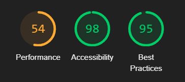

# Testing

Visit the deployed site: [GLIM](https://glim-9f608ab3b04d.herokuapp.com)

- - -

## CONTENTS

- [Testing](#testing)
  - [CONTENTS](#contents)
  - [AUTOMATED TESTING](#automated-testing)
    - [HTML Validation](#html-validation)
    - [CSS Validation](#css-validation)
    - [JS Validation](#js-validation)
    - [Python Validation](#python-validation)
    - [Lighthouse](#lighthouse)
  - [MANUAL TESTING](#manual-testing)
    - [Testing User Stories](#testing-user-stories)
    - [Full Testing](#full-testing)
    - [Known Bugs](#known-bugs)
    - [Solved Bugs](#solved-bugs)

Testing was ongoing throughout the entire build. I utilized Chrome developer tools whilst building to pinpoint and troubleshoot any issues as I went along.

During development I made use of google developer tools to ensure everything was working correctly and to assist with troubleshooting when things were not working as expected.

I have gone through each page using google chrome developer tools to ensure that each page is responsive on a variety of different screen sizes and devices.

- [W3C](https://validator.w3.org/) was used to check the HMTL & CSS.
- [CI linter](https://pep8ci.herokuapp.com/) was used to check Python code
- [JSHint](https://jshint.com/) was used to check Java Script
- - -

## AUTOMATED TESTING

  
### HTML Validation
All the HTML files were taken from each page source and passed through the W3C validator with no errors flagged except for one error that is related to React title tag in the index.html file.

- Error: Element title not allowed as child of element head in this context.
  

### CSS Validation
All CSS files were passed through the W3C validator and no errors were flagged. 

 

### JS Validation
Code errors and issues were detected using the Prettier plugin in GitPod, and immediately fixed throughout development.

### Lighthouse

I used Lighthouse within the Chrome Developer Tools to test the performance, accessibility, best practices and SEO of the website.

Overall, the lighthouse scores are good. To achieve better scores I converted all images to the webp format and used cloudinary SDK to resize images on request.

Home Page

Desktop

Mobile

About Page

Desktop

Mobile

Movies Page

Desktop

Mobile

Movie Page

Desktop

Mobile

Movie Form Page

Desktop

Mobile

User Profile Page

Desktop

Mobile

Profile Form Page

Desktop

Mobile

Sign-in Page

Desktop

Mobile

Sign-up Page

Desktop

Mobile

Tickets Page

Desktop

Mobile

- - -

## MANUAL TESTING

### Testing User Stories

`Epic: Registration / Log in`

| Goals | How are they achieved? | Links & Images |
| :--- | :--- | :--- |
|As a manager I can log in to the website so that I can add, edit or delete movies and info, and have admin privileges| By giving different permissions to users and managers |[Movies manager ](documentation/pages_movies_manager.jpg), [Movies user ](documentation/pages_movies.jpg)
|As a user I can log in to the website so that I can interact with other users| By adding the sign-in page and limit the functionality for unregistered users |[Sign-up](documentation/pages_signin.jpg), [Comment](documentation/pages_comment_not_logged.jpg)
|As a user I can register on the website so that I can create an account| By adding the functionality of creating user accounts|[Sign-up](documentation/pages_signup.jpg)

 

`Epic: Profiles`

| Goals | How are they achieved? | Links & Images |
| :--- | :--- | :--- |
|As a registered user I can have my avatar and username on the nav bar so that I can know that I am logged in and get access to the user menu| By creating a notification area on the navbar and in the side navmenu |[Navbar](documentation/page_navbar_logged.jpg), [Side navmenu](documentation/pages_home_side_logged.jpg)
|As a registered user I can access my profile page so that I can check my info and tickets| By creating a user profile page |[User profile page](documentation/pages_profile.jpg)
|As a registered user I can update my profile email so that I can receive important messages| By creating a user profile form page |[User profile form](documentation/pages_profile.jpg)
|As a registered user I can update my profile avatar so that I can distinguish my profile| By creating a user profile form page |[User profile form](documentation/pages_profile.jpg)

 

`Epic: About Info`

| Goals | How are they achieved? | Links & Images |
| :--- | :--- | :--- |
|As an unregistered user / manager, registered user / manager I can click on the social media info buttons so that I can check popularity and other info about the cinema| By Adding social media links to the side navmenu|[Side navmenu](documentation/pages_home_side_logged.jpg)
|As an unregistered user / manager, registered user / manager I can send a message to the admin so that I can ask a question or complain|Was not implemented| 
|As a un registered user / manager, registered user / manager I can view info about the cinema so that I can decide to buy a ticket or not| By creating an about page|[About page](documentation/pages_about.jpg)

 

`Epic: Movies`

| Goals | How are they achieved? | Links & Images |
| :--- | :--- | :--- |
|As a manager I can delete a movie so that I can manage the website| By giving different permissions to users and managers and creating a delete button under the movie poster in movies page|[Movies manager ](documentation/pages_movies_manager.jpg), [Movies user ](documentation/pages_movies.jpg)
|As a manager I can update a movie so that I can manage the website| By giving different permissions to users and managers and creating the edit movie form|[Movies manager ](documentation/pages_movies_manager.jpg), [Movies user ](documentation/pages_movies.jpg), [Edit movie form](documentation/pages_movies_add.jpg)
|As a manager I can update a movie so that I can manage the website| By giving different permissions to users and managers and creating a draft option in the add movie form|[Movies manager ](documentation/pages_movies_manager.jpg), [Movies user ](documentation/pages_movies.jpg), [Add movie form](documentation/pages_movies_add.jpg)
|As an manager I can add a movie so that I can manage the website| By giving different permissions to users and managers and creating the add movie form|[Movies manager ](documentation/pages_movies_manager.jpg), [Movies user ](documentation/pages_movies.jpg), [Add movie form](documentation/pages_movies_add.jpg)
|As an unregistered user / registered user / manager I can watch a movie trailer so that I can decide to watch it or not| By adding a watch trailer button to each movie banner on the home page and in the movie page|[Movie banner](documentation/pages_banner_two_months.jpg), [Movie page](documentation/pages_movie.jpg)
|As an unregistered user / manager, registered user / manager I can view the comments on a movie so that I can get some info about it| By adding a comment section in the movie page|[Movie page](documentation/pages_movie.jpg)
|As an unregistered user / manager, registered user / manager I can view the details about a movie so that I can decide to watch it or not| By adding an info section in the movie page|[Movie page](documentation/pages_movie.jpg)
|As a unregistered user / manager, registered user / manager I can view the quantity of comments so that I can check popularity of the movie| By adding a comments counter on each movie banner|[Movie banner](documentation/pages_banner_two_months.jpg)
|As a un registered user / manager, registered user / manager I can view the quantity of likes so that I can check popularity of the movie| By adding a like counter on each movie banner and the movie page|[Movie banner](documentation/pages_banner_two_months.jpg), [Movie page](documentation/pages_movie.jpg)
|As a unregistered user / manager, registered user / manager I can view the home page so that I can see the movies available to watch and be able to register
| By creating a movie banners carousel on the home page |[Home page](documentation/pages_home.jpg)

 

`Epic: Interact`

| Goals | How are they achieved? | Links & Images |
| :--- | :--- | :--- |
|As a manager I can validate users comments so that I can manage the comments section| By adding the functionality of validating user's comments in the admin panel|
|As a registered user / manager I can delete a comment on a movie so that I can interact with other users| By adding the permission to delete own comment to registered users and managers| [Comment](documentation/pages_comment_owner.jpg)
|As a registered user / manager I can write a comment on a movie so that I can interact with other users| By adding a comments form for registered users| [Comments form](documentation/pages_comment_form.jpg)
|As a registered user / manager I can like a movie so that I can interact with other users| By adding a like button on each movie banner and in the movie page| [Movie banner](documentation/pages_banner_two_months.jpg), [Movie page](documentation/pages_movie.jpg)
|As a registered user / manager I can update a comment on a movie so that I can interact with other users|Was not implemented|
 

`Epic: Tickets`

| Goals | How are they achieved? | Links & Images |
| :--- | :--- | :--- |
|As a registered user / manager I can reserve a seat so that I can buy a ticket| By adding tickets page for registered users and the functionality of clicking a seat to reserve it| [Tickets page](documentation/gif_tickets_reserve.gif)
|As a registered user / manager I can choose a show date so that I can buy the right ticket| By adding a show dates calendar on each movie banner in the home page and in the movie page| [Movie banner](documentation/gif_banner-all_hover.gif), [Movie page](documentation/pages_movie.jpg)
|As a registered user / manager I can view the hall info so that I can reserve a seat| By adding tickets page for registered users and the functionality of clicking a seat to reserve it| [Tickets page](documentation/gif_tickets_reserve.gif)
|As a unregistered user / manager, registered user / manager I can view the reserved seats for a movie so that I can check the availability| By adding tickets page for registered users and the functionality of clicking a seat to reserve it| [Tickets page](documentation/gif_tickets_reserve.gif)

 

`Epic: Purchase`

| Goals | How are they achieved? | Links & Images |
| :--- | :--- | :--- |
|As a registered user / manager I can cancel the reserve for a seat so that I can buy the ticket quantity needed| By adding tickets page for registered users and the functionality of clicking a seat to reserve and unreserve it| [Tickets page](documentation/gif_tickets_reserve.gif)
|As a registered user / manager I can pay for the ticket so that I can attend the movie show on that date| Was not implemented| 

### Full Testing

Full testing was performed on the following devices, and additional testing for other devices was carried out using developer tools:

windows laptop, ultrawide 20" monitor, 16:9 24" monitor, 16:9 17" monitor.

Each device tested the site using the following browsers:

Google Chrome on Windows, Edge

`Home Page`

| Feature | Expected Outcome | Testing Performed | Result | Pass/Fail |
| --- | --- | --- | --- | --- |
| **NAVBAR** |  |  |  |  |
|  |  |  |  |  |
| Logo link | When clicked you are redirected to the home page | Clicked Logo | Redirected to home page | Pass|
| Bar menu button | When clicked side navmenu appears | Clicked button | Side navmenu appeared| Pass|
| Sign-in link | When clicked you are redirected to the sign-in page | Clicked link | Redirected to sign-in page | Pass|
| Sign-in link| When hover user icon turns red| Hover over the link | User icon turned red | Pass|
| Hello user link | When clicked you are redirected to the profile page | Clicked link | Redirected to profile page | Pass|
| Hello user link | When hover message turns red| Hover over the link | Message turned red | Pass|
| **SIDE NAVMENU** |  |  |  |  |
|  |  |  |  |  |
| Logo link | When clicked you are redirected to the home page | Clicked Logo | Redirected to home page | Pass|
| Sign-in button | When clicked you are redirected to the sign-in page | Clicked button | Redirected to sign-in page | Pass|
| Sign-in button| When hover button color become dark| Hover over the button |  Button color became dark | Pass|
| Home link | When clicked you are redirected to the home page | Clicked the link | Redirected to home page | Pass| -->
| Home link hover | When hover back ground highlights | Hover over the link | Background highlighted | Pass|
| About link | When clicked you are redirected to the About page | Clicked the link | Redirected to About page | Pass|
| About link hover | When hover back ground highlights  | Hover over the link | Background highlighted | Pass|
| Social media link | When clicked you are redirected to the corresponding social media page | Clicked the link | Redirected to the corresponding social media page | Pass|
| Social media link hover | When hover a red circle appears around social media logo  | Hover over the link | A red circle appeared around social media logo | Pass|
| My cabinet link (registered user) | When clicked you are redirected to the profile page | Clicked the link | Redirected to profile page | Pass|
| My cabinet link (registered user) hover | When hover text color become red  | Hover over the link | Text color became red | Pass|
| Sign out button (registered user)| When clicked the user logs out and redirected to the home page | Clicked button | The user logged out and redirected to the home page | Pass|
| Sign out button (registered user)| When hover button color becomes dark| Hover over the button |  Button color became dark | Pass|
| User's avatar (registered user)| When sign in avatar appears in the side navmenu | signed in |  Avatar appeared in the side navmenu | Pass|
| My cabinet link (registered user)| When sign in my cabinet link appears in the side navmenu | signed in |  My cabinet link appeared in the side navmenu | Pass|
| Sign out button (registered user)| When sign in Sign out button appears in the side navmenu | signed in |  Sign out button appeared in the side navmenu | Pass|
| Close button | When clicked the side navmenu closes | Clicked button | The side navmenu closed  | Pass|
| Close button| When hover button color becomes red| Hover over the button |  Button color became red | Pass|

| **MOVIES CAROUSEL** |  |  |  |  |
|  |  |  |  |  |
| Carousel slider left | When clicked the slider shift one position to the left| Clicked menu | The slider shifted one position to the left| Pass|
| Carousel slider right | When clicked the slider shift one position to the right| Clicked menu | The slider shifted one position to the right| Pass|
| Movie banner | When hover info appears| Hovered movie banner | Info appeared| Pass|
| Like button hover (registered user)| When hover heart color become red  | Hover over the button | Heart color became red | Pass|
| Like button hover (unregistered user)| When hover log in message appears  | Hover over the button | Log in message appeared | Pass|
| Like button hover (manager)| When hover not allowed message appears  | Hover over the button | Not allowed message appeared | Pass|
| Like button (unregistered user)| When clicked disabled | Clicked the button | Button disabled | Pass|
| Like button (registered user)| When clicked heart changes to solid and the the like counter increases by one and movie is liked | Clicked the button | Heart changed to solid and the the like counter increased by one and movie was liked | Pass|
| Like button (manager)| When clicked disabled  | Clicked the button | Button disabled | Pass|
| Comments button hover | When hover icon color becomes red  | Hover over the button | Icon color became red | Pass|
| Comments button| When clicked redirects the user to the movie page | Clicked the button | Redirected the user to the movie page | Pass|
| Watch trailer button hover | When hover button color becomes red  | Hover over the button | Button color became red | Pass|
| Watch trailer button| When clicked redirects the user to the movie trailer page | Clicked the button | Redirected the user to the movie trailer page | Pass|
| Watch trailer button hover | When hover button color becomes red  | Hover over the button | Button color became red | Pass|
| Watch trailer button| When clicked redirects the user to the movie trailer page | Clicked the button | Redirected the user to the movie trailer page | Pass|
| Buy a ticket button hover | When hover button color becomes darker  | Hover over the button | Button color became darker | Pass|
| Buy a ticket button hover (unregistered user) | When hover button color becomes darker and log in message appears | Hover over the button | Button color became darker and log in message appeared| Pass|
| Buy a ticket button (unregistered user) | When clicked redirects the user to sign-in page | Clicked the button | Redirected the user to the sign-in page | Pass|
| Buy a ticket button (registered user and date button clicked) | When clicked redirects the tickets page | Clicked the button | Redirected the user to the tickets page | Pass|
| Date button hover | When hover button color becomes dark gray  | Hover over the button | Button color became dark gray | Pass|
| Date button| When clicked button color becomes red | Clicked the button | Button color becomes red | Pass|
| Movie title button hover | When hover curser changes to pointer | Hover over the button | Curser changed to a pointer | Pass|
| Movie title button| When clicked redirects the user to the movie page | Clicked the button | Redirected the user to the movie page | Pass|

 

`Movies Page`

| Feature | Expected Outcome | Testing Performed | Result | Pass/Fail |
| --- | --- | --- | --- | --- |
| **MOVIES** |  |  |  |  |
|  |  |  |  |  |
| Movie poster hover | When hover poster image becomes darker | Button hovered | Poster image became darker | Pass|
| Movie poster | When clicked redirects the user to the movie page | Button clicked | Redirected the user to the movie page| Pass|
| Add+ button (manager) hover | When hover button color becomes darker | Hover over the button | Button color became darker | Pass|
| Add+ button (manager)| When clicked redirects the user to the movie add form page | Clicked the button | Redirected the user to the movie add form page | Pass|
| Edit button (manager) hover | When hover button color becomes darker | Hover over the button | Button color became darker | Pass|
| Edit button (manager)| When clicked redirects the user to the movie edit form page | Clicked the button | Redirected the user to the movie edit form page | Pass|
| Delete button (manager) hover | When hover button color becomes darker | Hover over the button | Button color became darker | Pass|
| Delete button (manager)| When clicked a confirmation modal appears with the movie name | Clicked the button | A Confirmation modal appeared  | Pass|

| **CONFIRMATION MODAL** |  |  |  |  |
|  |  |  |  |  |

| Close button (manager) hover | When hover button color becomes red | Hover over the button | Button color became red | Pass|
| Close button (manager)| When clicked the confirmation modal disappears | Clicked the button | The Confirmation modal disappeared  | Pass|
| Delete button (manager) hover | When hover button color becomes darker | Hover over the button | Button color became darker | Pass|
| Delete button (manager)| When clicked the Movie is deleted from DB | Clicked the button | The Movie is deleted from DB  | Pass|

 

`About Page`

| Feature | Expected Outcome | Testing Performed | Result | Pass/Fail |
| --- | --- | --- | --- | --- |
| **GOOGLE MAPS** |  |  |  |  |
|  |  |  |  |  |
| Google maps | On page load map appears with the position and basic functionality | Page loaded| Map appeared with the position and basic functionality | Pass|

 

`My Cabinet Page`

| Feature | Expected Outcome | Testing Performed | Result | Pass/Fail |
| --- | --- | --- | --- | --- |
| **USER INFO** |  |  |  |  |
|  |  |  |  |  |
| User avatar (registered user) | On page load User's avatar or default placeholder appears | Page loaded| User's avatar or default placeholder appeared | Pass|
| Edit button (registered user) hover | When hover button color becomes darker | Hover over the button | Button color became darker | Pass|
| Edit button (registered user)| When clicked redirects the user to the profile form page | Clicked the button | Redirected the user to the profile form page  | Pass|
| My tickets button (registered user and tickets active) hover | When hover nothing happens | Hover over the button | Nothing happened | Pass|
| My tickets button (registered user and tickets not active) hover | When hover button color becomes darker | Hover over the button | Button color became darker | Pass|
| My tickets button (registered user and tickets active)| When clicked nothing happens | Clicked the button | Nothing happened | Pass|
| My tickets button (registered user and tickets not active)| When clicked the user tickets appears | Clicked the button | The user tickets appeared  | Pass|
| My comments button (registered user and comments active)| When clicked nothing happens | Clicked the button | Nothing happened | Pass|
| My comments button (registered user and comments not active)| When clicked the user comments appears | Clicked the button | The user comments appeared  | Pass|

| **TICKETS** |  |  |  |  |
|  |  |  |  |  |
| Movie poster button (registered user) hover| When hover the poster image become darker| Hover over the button | The poster image become darker | Pass|
| Movie poster button (registered user)| When clicked redirects the user to the movie page | Clicked the button | Redirected the user to the movie page | Pass|

| **COMMENTS** |  |  |  |  |
|  |  |  |  |  |
| Movie poster button (registered user) hover| When hover the poster image become darker| Hover over the button| The poster image become darker | Pass|
| Movie poster button (registered user)| When clicked redirects the user to the movie page | Clicked the button | Redirected the user to the movie page | Pass|

 

`Movie Page`

| Feature | Expected Outcome | Testing Performed | Result | Pass/Fail |
| --- | --- | --- | --- | --- |
| **INFO** |  |  |  |  |
|  |  |  |  |  |
| Watch trailer button hover| When hover the button color becomes red| Hover over the button| the button color becomes red | Pass|
| Watch trailer button | When clicked redirects the user to the movie trailer page | Clicked the button | Redirected the user to the movie trailer page | Pass|
| Like button hover (registered user)| When hover heart color become red  | Hover over the button | Heart color became red | Pass|
| Like button hover (unregistered user)| When hover log in message appears  | Hover over the button | Log in message appeared | Pass|
| Like button hover (manager)| When hover not allowed message appears  | Hover over the button | Not allowed message appeared | Pass|
| Like button (unregistered user)| When clicked disabled | Clicked the button | Button disabled | Pass|
| Like button (registered user)| When clicked heart changes to solid and the the like counter increases by one and movie is liked | Clicked the button | Heart changed to solid and the the like counter increased by one and movie was liked | Pass|

| **CALENDAR** |  |  |  |  |
|  |  |  |  |  |
| Buy a ticket button hover | When hover button color becomes darker  | Hover over the button | Button color became darker | Pass|
| Buy a ticket button hover (unregistered user) | When hover button color becomes darker and log in message appears | Hover over the button | Button color became darker and log in message appeared| Pass|
| Buy a ticket button (unregistered user) | When clicked redirects the user to sign-in page | Clicked the button | Redirected the user to the sign-in page | Pass|
| Buy a ticket button (registered user and date button clicked) | When clicked redirects the tickets page | Clicked the button | Redirected the user to the tickets page | Pass|
| Date button hover | When hover button color becomes dark gray  | Hover over the button | Button color became dark gray | Pass|
| Date button| When clicked button color becomes red | Clicked the button | Button color becomes red | Pass|

| **COMMENTS** |  |  |  |  |
|  |  |  |  |  |
| Login button hover | When hover button color becomes darker  | Hover over the button | Button color became darker | Pass|
| Login button (unregistered user)| When clicked redirects the user to the Sign-in page | Clicked the button | Redirected the user to the Sign-in page | Pass|
| Login button (registered user and empty comment)| When clicked nothing happens | Clicked the button | Nothing happened | Pass|
| Login button (registered user and comment and previous comment validated )| When clicked submits comment and disables the button and wait approval message appears | Clicked the button | Comment submitted and the button is disabled and wait approval message appeared | Pass|
| Login button (registered user and previous comment not validated )| When clicked button disabled | Clicked the button | Button disabled| Pass|
| Page scroll down | When scroll down (end of page) next 10 comments downloads | Page scrolled down | next 10 comments downloaded | Pass|
| Delete button hover (User is owner) | When hover button color becomes darker  | Hover over the button | Button color became darker | Pass|
| Delete button (User is owner) | When clicked a confirmation modal appears | Clicked the button | A confirmation modal appeared | Pass|

| **CONFIRMATION MODAL** |  |  |  |  |
|  |  |  |  |  |
| Confirm button hover (User is owner) | When hover button color becomes darker  | Hover over the button | Button color became darker | Pass|
| Confirm button (User is owner) | When clicked the comment is deleted from the DB | Clicked the button | The comment is deleted from the DB | Pass|
| Cancel button hover (User is owner) | When hover button color becomes red  | Hover over the button | Button color became red | Pass|
| Cancel button (User is owner) | When clicked the Modal disappears | Clicked the button |  The Modal disappeared | Pass|

 

`Tickets Page`

| Feature | Expected Outcome | Testing Performed | Result | Pass/Fail |
| --- | --- | --- | --- | --- |
| **SEATS** |  |  |  |  |
|  |  |  |  |  |
| Seat button hover (Registered user and seat not purchased and not reserved)| When hovered a seat info bubble message appears on top of the button | Hovered over the button | a seat info bubble message appears on top of the button | Pass|
| Seat button hover(Registered user and ( seat purchased or reserved by other user) )| When hovered nothing happens | Hovered over the button | Nothing happened | Pass|
| Seat button (Registered user and seat not purchased and not reserved)| When Clicked the button becomes red and a ticket appears in the tickets panel | Clicked the button | The button became red and a ticket appeared in the tickets panel | Pass|

| Seat button (Registered user and reserved by the user)| When Clicked the button becomes white and a ticket disappears from the tickets panel | Clicked the button | The button became white and a ticket disappeared from the tickets panel | Pass|
| Seat button (Registered user and purchased)| When Clicked the button is disabled icon color is dark gray | Clicked the button | The button is disabled icon color is dark gray | Pass|
| Seat button (Registered user and reserved and expired(more than 3 minutes))| When Clicked button is enabled icon color is white | Clicked the button | button is enabled icon color is white | Pass|
| **TICKETS** |  |  |  |  |
|  |  |  |  |  |
| Ticket| When Added the sum updates | Ticket added | the sum updated | Pass|
| Ticket| When deleted the sum updates | Ticket deleted | the sum updated | Pass|

| Reserve button hover (Registered user) | When hover button color becomes darker  | Hover over the button | Button color became darker | Pass|
| Reserve button (Registered user) | When clicked a confirmation modal appears | Clicked the button |  A confirmation modal appears | Pass|
| **CONFIRMATION MODAL** |  |  |  |  |
|  |  |  |  |  |
| Cancel button hover  | When hover button color becomes red  | Hover over the button | Button color became red | Pass|
| Cancel button  | When clicked redirects the user to the home page | Clicked the button |  The user is redirected to the home page | Pass|
| Check tickets button hover  | When hover button color becomes darker  | Hover over the button | Button color became darker | Pass|
| Check tickets button  | When clicked redirects the user to the profile page | Clicked the button |  The user is redirected to the profile page | Pass|
 

`Edit Profile Form Page`

| Feature | Expected Outcome | Testing Performed | Result | Pass/Fail |
| --- | --- | --- | --- | --- |
| **FORM** |  |  |  |  |
|  |  |  |  |  |
| Change the image button hover  | When hover button color becomes darker  | Hover over the button | Button color became darker | Pass|
| Change the image button  | When clicked a file browser window opens | Clicked the button |  A file browser window opened | Pass|
| Change the image button (image is chosen ) | When clicked the avatar image changes | Clicked the button |  The avatar image changed | Pass|

| Input elements | When text typed  input text updates  | Typed text | input text updated | Pass|

| Cancel button hover  | When hover button color becomes darker  | Hover over the button | Button color became darker | Pass|
| Cancel button  | When clicked a redirects the user back to the profile page | Clicked the button |  The user is redirected back to the profile page | Pass|

| Save button hover  | When hover button color becomes darker  | Hover over the button | Button color became darker | Pass|
| Save button  | When clicked the form submits and redirects the user back to the profile page | Clicked the button |  The form is submitted and the user is redirected back to the profile page | Pass|

 

`Add Movie Form Page`

| Feature | Expected Outcome | Testing Performed | Result | Pass/Fail |
| --- | --- | --- | --- | --- |
| **FORM** |  |  |  |  |
|  |  |  |  |  |
| Upload the image button hover  | When hover button color becomes lighter  | Hover over the button | Button color became lighter | Pass|
| Upload the image button  | When clicked a file browser window opens | Clicked the button |  A file browser window opened | Pass|
| Upload the image button (image is chosen ) | When clicked the avatar image uploads | Clicked the button |  The avatar image uploaded | Pass|

| Input elements | When text typed  input text updates  | Typed text | input text updated | Pass|

| Date input elements | When clicked  a calendar appears  | Input clicked | A calendar appeared | Pass|
| Date input elements (calendar) | When date picked the input date updates | Date picked | The input date updated | Pass|

| Time input elements | When clicked  a clock appears  | Input clicked | A clock appeared | Pass|
| Time input elements (clock) | When date picked the input time updates | Time picked | The input time updated | Pass|

| Drop down menu input elements | When clicked  a menu appears  | Input clicked | A menu appeared | Pass|
| Drop down menu input (menu) | When item picked the input element updates | Time picked | The input element updated | Pass|

| Cancel button hover  | When hover button color becomes darker  | Hover over the button | Button color became darker | Pass|
| Cancel button  | When clicked a redirects the user back to the movies page | Clicked the button |  The user is redirected back to the movies page | Pass|

| Save button hover  | When hover button color becomes darker  | Hover over the button | Button color became darker | Pass|
| Save button  | When clicked the form submits and redirects the user to the created movie page | Clicked the button |  The form is submitted and the user is redirected to the created movie page | Pass|

 

`Edit Movie Form Page`

| Feature | Expected Outcome | Testing Performed | Result | Pass/Fail |
| --- | --- | --- | --- | --- |
| **FORM** |  |  |  |  |
|  |  |  |  |  |
| Change the image button hover  | When hover button color becomes darker  | Hover over the button | Button color became darker | Pass|
| Change the image button  | When clicked a file browser window opens | Clicked the button |  A file browser window opened | Pass|
| Change the image button (image is chosen ) | When clicked the avatar image changes | Clicked the button |  The avatar image changed | Pass|

| Input elements | When text typed  input text updates  | Typed text | input text updated | Pass|

| Date input elements | When clicked  a calendar appears  | Input clicked | A calendar appeared | Pass|
| Date input elements (calendar) | When date picked the input date updates | Date picked | The input date updated | Pass|

| Time input elements | When clicked  a clock appears  | Input clicked | A clock appeared | Pass|
| Time input elements (clock) | When date picked the input time updates | Time picked | The input time updated | Pass|

| Drop down menu input elements | When clicked  a menu appears  | Input clicked | A menu appeared | Pass|
| Drop down menu input (menu) | When item picked the input element updates | Time picked | The input element updated | Pass|

| Cancel button hover  | When hover button color becomes darker  | Hover over the button | Button color became darker | Pass|
| Cancel button  | When clicked a redirects the user back to the movies page | Clicked the button |  The user is redirected back to the movies page | Pass|

| Save button hover  | When hover button color becomes darker  | Hover over the button | Button color became darker | Pass|
| Save button  | When clicked the form submits and redirects the user to the created movie page | Clicked the button |  The form is submitted and the user is redirected to the created movie page | Pass|

 

### Known Bugs

| Known Bug No | Bug Issue | Plan to Resolve |
| :--- | :--- | :--- |
| 1 | when the user scrolls through the movie's carrousel and reach the last slide (banner). on ultra wide monitors it will show part of the first from the left banner till the user scrolls to the start | Try to find a way to always align the first banner to the edge of the window |

 

### Solved Bugs

| Bug No | Bug Issue | How Resolved |
| :--- | :--- | :--- |
| 1 | when a seat is clicked (reserved =true), after 3 minutes it should be deleted. but this doesn't happen if the user refreshes the page and the seat will be for ever reserved | added a new field in the tickets modal (expired) the serializer calculates if 3 minutes have passed and return true or false and on the front and added a new permission that allowed any user the ability to delete a ticket if it is expired (but not purchased). And it will be deleted from the front end if encountered |
| 2 | When the previous bug was resolved another one  related to it appeared. the cleaning function that deleted the tickets after 3 minutes also deleted the purchased tickets | this was resolved by not using the cleaning function and relay only on the backend|
| 3 | When the user refreshes the tickets page the state is nulled and the page will not work at first I redirected the user to the home page but I thought this is not convenient | this was resolved by saving the needed state to the local storage |
| 4 | When the user click on watch trailer button and a trailer video player appears. If the user navigate to another page and open another move it will show the page with the video trailer active | this was resolved by adding a useEffect function that detects redirects and set the showTrailer state to false |

 

Back to [README.md](README.md)